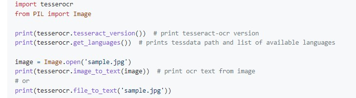

# text_recognition_app

This is a simple application designed to get text included in images. It is based on Tesseract-OCR.

---
# Table of contents
1. [How it works](#how-it-works)
2. [Settings](#example-inputoutput)
3. [Example Input/Output](#settingst)
4. [Libraries Used](#libraries-used)
5. [Getting Started](#getting-started)
6. [Files descrption](#files-description)
7. [TODO](#todo)

---
## How it works
After running a Python script ("GUI_test.py" file) a small window app will appear. The only thing you need to do next is to drop your files in a window and press submit. The text will appear in "where_text_goes.txt" file.

---
## Settings

### Language
Choose in which language the text is in a picture is (default=English)
### Append/Write
Choose if you want to ovewrite data in "where_text_goes.txt" file (default=Append)
### List of files
It is a list of files that text recognition will run.
### Delete
Deletes a name of a file from the list of files.
### Delete all
Deletes all file names in list of files.

---
## Example Input/Output



```py
import tesserocr
from PIL import Image

print(tesserocr.tesseract_version()) # print tesseract-ocr version
print(tesserocr.get_languages()) # prints tessdata path and list of available languages

image = Inage.open(’sample.jpg’)
print(tesserocr. inage_to_text(inage)) # print ocr text from inage
# or

print(tesserocr. file_to_text('sample.jpg’))
```

---
## Libraries Used
- PyQt5
- OpenCV
- Pytesseract - the easiest installation and configuration comes from this [repo](https://github.com/simonflueckiger/tesserocr-windows_build)
- Leptonica

---
## Getting Started
* before using it you must get the [tess_data](https://github.com/tesseract-ocr/tessdata) - you can clone the repository or download zip
* requires installating additional libraries mentioned above
* after installing the tess_data copy the path to a folder and place it in the "path" in "text_recognition_function.py"

---
## Files description

### GUI_test.py
File you should run, main 
### arrowbutton_class.py
File with custom arrow button widget
### filebase_class.py
File with class that handles correctness and storage of file's path
### firstscreen_class.py
File with main screen code
### lang_list_support.py
File with list of laungages
### language_dict.py
Dictionary that connects languages to their folder's names with data
### second_screen_class.py
File with settings screen code
### support_dictionary.py
Dictionary with append/write handling
### text_recognition_function.py
Tessearct-OCR API and running the actual text recognition
### where_text_goes.txt
That is where the recognized text goes

---
## TODO
* add pdf handling
* upgrade GUI
* create executable

---
